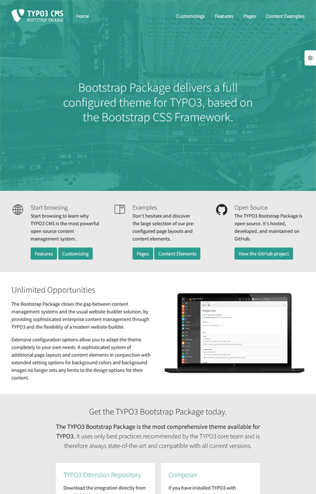

# Bootstrap Package Base Package

Create a Sitepackage based on the Bootstrap Package with two easy steps.



## Installation

Run the following line to install the Sitepackage in your project:

```bash
composer require your-vendor/your-sitepackage
```

## Support

We do not provide support, sorry!
